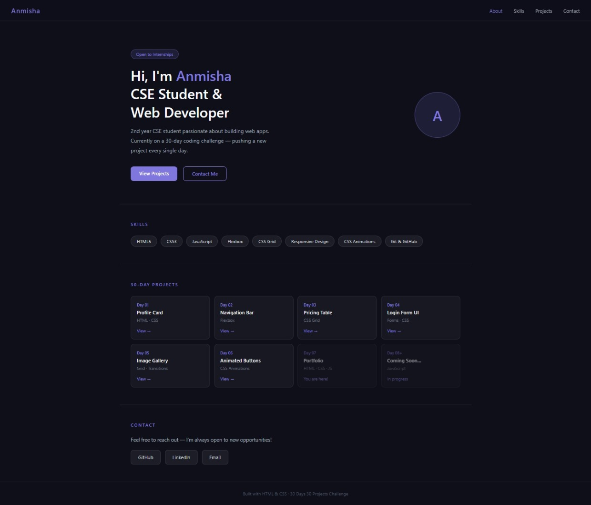

# Day 07 — One Page Portfolio

A dark-themed personal portfolio website built with pure HTML and CSS.

## Preview

## Features
- Sticky navbar with smooth scroll
- Mobile hamburger menu
- Hero section with CTA buttons
- Skills section with hover effects
- Projects grid showing all 30-day projects
- Contact section with links
- Fully responsive — works on all screen sizes

## Tech Stack
- HTML5
- CSS3 (Flexbox, Grid, sticky positioning, backdrop-filter)
- Vanilla JavaScript (mobile menu toggle, active nav highlight)

## What I Learned
- Sticky navbar with backdrop blur
- Smooth scrolling between sections
- Active nav link highlight on scroll
- Mobile-first responsive design

## Part of
[30 Days 30 Projects](https://github.com/anmisha-dash/30-days-30-projects) challenge
